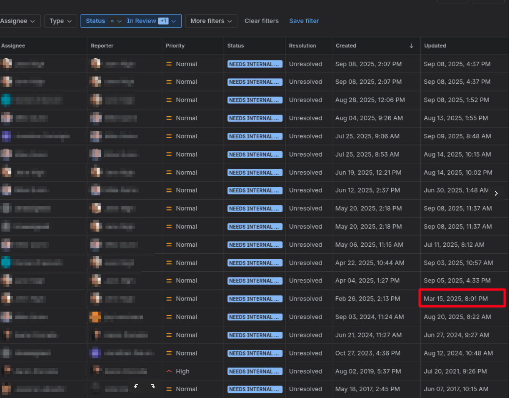
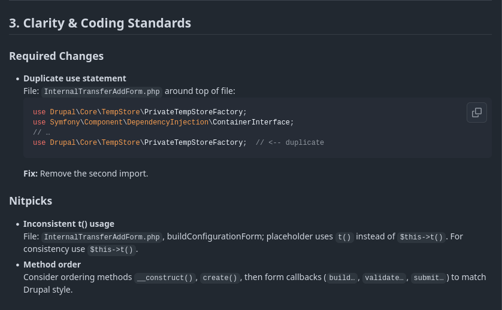

# AI in the Code Review Pipeline
## Practical Wins, Real Limits

*Lunch & Learn*
Jonathan · grndlvl

---

# Why This Talk?

I wanted to cut down bottlenecks in PR review and test AI in real workflows.

**AI ≠ replacement, AI = multiplier**

<!-- Presenter:

- There are several uses of AI in the workflow lifecyle.
- Only focus on 2
    - Code review
    - Agentic coding
-->

---

# Why Code Review Matters

✅ Ensures quality and maintainability
✅ Catches bugs early
✅ Shares knowledge across the team
✅ An essential training tool

⚠️ But… it’s also:
- Time-consuming
- Inconsistent
- Frustrating bottleneck

---

# The Code Review Bottleneck

- PRs waiting too long
- Style nitpicks dominate
- Inconsistent review quality

---

# AI-Assisted Code Review

**GitHub Action + LLM = Faster Feedback**

- Flags style, complexity, docs issues
- Summarizes diffs
- Trains junior devs with best practices

<!-- Presenter:
Catches log hanging fruit before it gets assigned to a review.
-->

---

# Benefits vs. Limitations

**Benefits**
- Speed
- Consistency
- Reviewer focus

**Limitations**
- False positives
- Needs oversight
- Not architecture-level

---

# Agentic Coding Defined

> “LLM acts like a junior dev — write, test, fix, repeat.”

**Loop:**
Generate → Test → Fix → Repeat

---

# Example Workflow with Codex

1. Generate initial function
2. Run tests
3. AI refines until green

*Visual: small code snippet evolving through 2–3 iterations*

---

# Other Workflows AI Helps In

- Docs generation 📖
- Test scaffolding 🧪
- Refactoring ♻️
- CI/CD pipelines ⚙️
- Knowledge capture 🧠

---

# Human in the Loop

**AI excels at:**
- Boilerplate
- Docs
- Testing

**Humans must own:**
- System design
- Security
- Trade-offs

---

# Takeaways

- Code review augmentation → productivity gains
- Agentic coding → good for prototypes, not production alone
- Humans stay essential

---

# Q&A

❓

*Where would you trust AI in your own workflow?*
